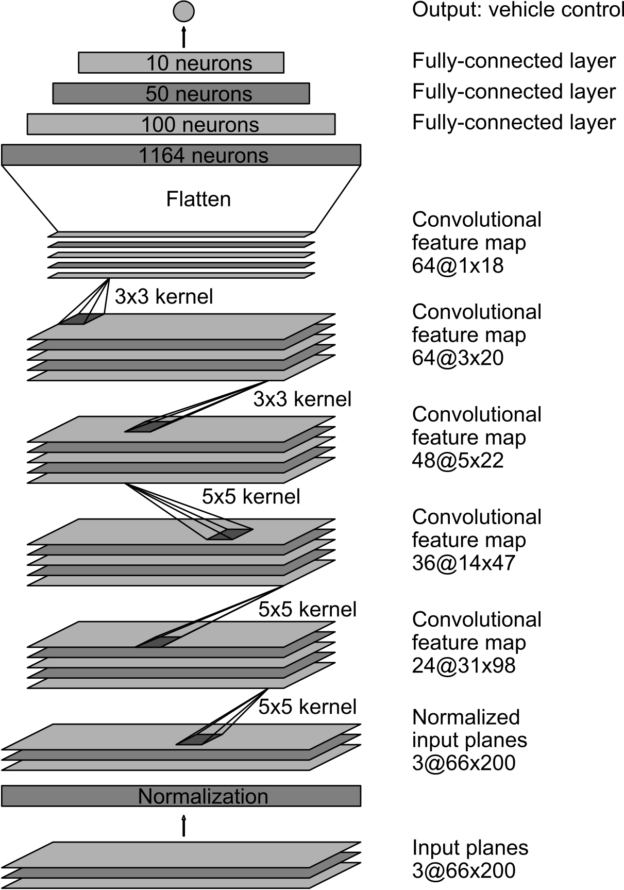

# **Behavioral Cloning** 

The goals / steps of this project are the following:
* Use the simulator to collect data of good driving behavior
* Build, a convolution neural network in Keras that predicts steering angles from images
* Train and validate the model with a training and validation set
* Test that the model successfully drives around track one without leaving the road
* Summarize the results with a written report

## Rubric Points
### Here I will consider the [rubric points](https://review.udacity.com/#!/rubrics/432/view) individually and describe how I addressed each point in my implementation.  

---
### Files Submitted & Code Quality

#### 1. Submission includes all required files and can be used to run the simulator in autonomous mode

My project includes the following files:
* model.py containing the script to create and train the model
* drive.py for driving the car in autonomous mode
* model.h5 containing a trained convolution neural network 
* README.md summarizing the results

#### 2. Submission includes functional code
Using the Udacity provided simulator and my drive.py file, the car can be driven autonomously around the track by executing 
```sh
python drive.py model.h5
```

#### 3. Submission code is usable and readable

The model.py file contains the code for training and saving the convolution neural network. The file shows the pipeline I used for training and validating the model, and it contains comments to explain how the code works.

### Model Architecture and Training Strategy

#### 1. An appropriate model architecture has been employed

My model consists of a neural network with five convolution layers. The first three convolution layers use 5x5 filter sizes and depths between 24 and 48. The last two convolution layers use 3x3 filter sizes and depths of 64.

```python
# Layer 1: Convolutional. Filters = 24, Filter Size = 5x5, Strides = 2x2.
model.add(Convolution2D(24, 5, strides=(2, 2), activation="elu"))
# Layer 2: Convolutional. Filters = 36, Filter Size = 5x5, Strides = 2x2.
model.add(Convolution2D(36, 5, strides=(2, 2), activation="elu"))
# Layer 3: Convolutional. Filters = 48, Filter Size = 5x5, Strides = 2x2.
model.add(Convolution2D(48, 5, strides=(2, 2), activation="elu"))
# Layer 4: Convolutional. Filters = 64, Filter Size = 3x3, Strides = 1x1.
model.add(Convolution2D(64, 3, strides=(1, 1), activation="elu"))
# Layer 5: Convolutional. Filters = 64, Filter Size = 3x3, Strides = 1x1.
model.add(Convolution2D(64, 3, strides=(1, 1), activation="elu"))
```

The model includes ELU layers to introduce nonlinearity, and the data is normalized in the model using a Keras lambda layer. 

```python
# Layer 0: Normalization.
model.add(Lambda(lambda x: (x / 255.0) - 0.5))
```


#### 2. Attempts to reduce overfitting in the model

The model contains a dropout layer to reduce overfitting.

```python
# Dropout
model.add(Dropout(0.25))
```

The model was trained and validated on different data sets to ensure that the model was not overfitting.

```python
samples = load_samples(['data', 
                        'training1',
                        'reverse1',
                        'training2',
                        'reverse2',
                        'training3',
                        'reverse3',
                        'curve1',
                        'curve2'])
```

The model was tested by running it through the simulator and ensuring that the vehicle could stay on the track.

#### 3. Model parameter tuning

The model used an adam optimizer, so the learning rate was not tuned manually.

```python
model.compile(loss='mse', optimizer='adam')
```


#### 4. Appropriate training data

Training data was chosen to keep the vehicle driving on the road. I used a combination of center lane driving and driving counter-clockwise. I also included examples of driving smoothly around curves.

For details about how I created the training data, see the next section. 

### Model Architecture and Training Strategy

#### 1. Solution Design Approach

The overall strategy for deriving a model architecture was to use a well-known model architecture and adjust it to clone my driving behavior.

My first step was to use NVIDIA's network architecture for self-driving cars. This model is appropriate because it is able to perform lane following in autonomous vehicles.

In order to gauge how well the model was working, I split my image and steering angle data into a training and validation set. I found that the mean squared error decreased in every epoch in both the training and validation sets. This was an indication that the model was a good choice. I decided to add a dropout layer to reduce overfitting when training the model with more data.

The next step was to run the simulator to see how well the car was driving around track one. At first, I only used two dataset of center lane driving. However, the vehicle fell off the track when taking curves. I also noticed that the data had examples of taking only left curves.

To improve the overall driving behavior of the model, I used a combination of center lane driving and driving counter-clockwise. I also included examples of driving smoothly around curves.

I also applied data augmentation techniques such as using images from multiple cameras and flipping images and angle measurements.

At the end of the process, the vehicle is able to drive autonomously around the track without leaving the road.

#### 2. Final Model Architecture

The final model architecture consisted of a convolution neural network with the following layers and layer sizes.

| Layer           | Description                            |
| --------------- | -------------------------------------- |
| Input           | 160x320x3 RGB image                    |
| Cropping        | 70x25x3 RGB image                      |
| Normalization   | 70x25x3 normalized data values         |
| Convolution 5x5 | 24 filters, 2x2 strides                |
| ELU             | Non-linear activation                  |
| Convolution 5x5 | 36 filters, 2x2 strides                |
| ELU             | Non-linear activation                  |
| Convolution 5x5 | 48 filters, 2x2 strides                |
| ELU             | Non-linear activation                  |
| Convolution 3x3 | 64 filters, 1x1 strides                |
| ELU             | Non-linear activation                  |
| Convolution 3x3 | 64 filters, 1x1 strides                |
| ELU             | Non-linear activation                  |
| Dropout         | Drops 25% of input units randomly      |
| Flatten         | Flattens the input                     |
| Dense           | Fully-connected layer with 100 neurons |
| ELU             | Non-linear activation                  |
| Dense           | Fully-connected layer with 50 neurons  |
| ELU             | Non-linear activation                  |
| Dense           | Fully-connected layer with 10 neurons  |
| ELU             | Non-linear activation                  |
| Dense           | Fully-connected layer with 1 neurons   |
| ELU             | Non-linear activation                  |

Here is a visualization of the architecture

<p align="center">

</p>
<p align="center">
<b>Source:</b> <a href="https://developer.nvidia.com/blog/deep-learning-self-driving-cars/" target="_blank">End-to-End Deep Learning for Self-Driving Cars</a>
</p>

#### 3. Creation of the Training Set & Training Process

To capture good driving behavior, I first recorded two laps on track one using center lane driving. Here is an example image of center lane driving:

<p align="center">

</p>

I then recorded the vehicle driving counter-clockwise so that the model had examples of right turns. The purpose of this recordings is to have a more balanced dataset. Here is an example of counter-clockwise driving:

<p align="center">

</p> 

I also recorded the vehicle while driving smoothly around curves. I wanted the model to learn to stay centered while taking curves.

<p align="center">

</p>
<p align="center">

</p>
<p align="center">

</p> 

To augment the dataset, I also flipped images and angles thinking that this would balance the training. For example, here is an image that has then been flipped:

<p align="center">

</p>

After the collection process, I had 23,506 number of data points. I applied these preprocessing strategies:

- Convert images to RGB color space.
- Use images from multiple cameras by using a correction factor of 0.2
- Flip the images of all cameras and steering angles.


I finally randomly shuffled the data set and put 20% of the data into a validation set.

I used this training data for training the model. The validation set helped determine if the model was over or under fitting. The ideal number of epochs was 3 as evidenced by the training and validation errors. I used an adam optimizer so that manually training the learning rate wasn't necessary.